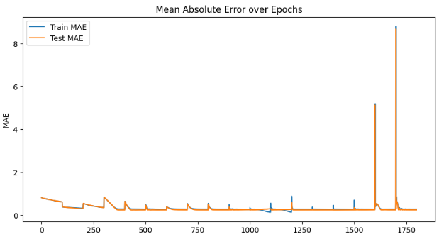
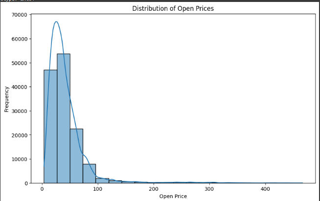
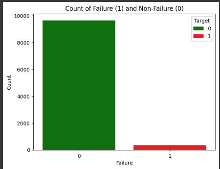
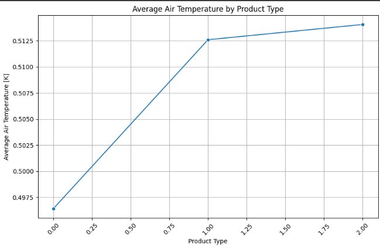

# Deep Learning Lab - PyTorch Implementation

This repository contains the implementation of Deep Neural Network (DNN) architectures using PyTorch for both regression and multi-class classification tasks. The lab exercises were conducted under the guidance of Pr. ELAACHAK Lotfi.

## Part One: Regression Task

### Dataset Description

The dataset used for regression task is sourced from Kaggle, containing data from NYSE. The dataset, named "prices-split-adjusted," includes the following columns:

- **date**: Date of the stock data
- **symbol**: Stock symbol
- **open**: Opening price of the stock
- **close**: Closing price of the stock
- **low**: Lowest price of the stock for the day
- **high**: Highest price of the stock for the day
- **volume**: Volume of stocks traded for the day

### Dataset Exploration

Exploratory Data Analysis (EDA) techniques were applied to understand and visualize the dataset.

### Deep Neural Network Architecture

A DNN architecture was established using PyTorch library to handle the regression task. The architecture includes input, hidden, and output layers.

### Hyperparameter Tuning

GridSearch tool from sklearn library was utilized to choose the best hyperparameters such as learning rate, optimizers, epoch, and model architecture to optimize the performance of the model.

### Loss and Accuracy Visualization

Graphs depicting Loss vs Epochs and Accuracy vs Epochs were visualized for both training and test data. Interpretations were provided based on the observed trends.

### Regularization Techniques

Several regularization techniques were applied to the architecture to mitigate overfitting. The performance of the regularized model was compared with the initial model.

#### MAE vs Epochs Graph

#### Price Frequency Graph

## Part Two: Multi-Class Classification Task

### Dataset Description

The dataset used for the multi-class classification task is named "predictive_maintenance". It contains the following columns:

- **UDI**: Unique Identifier
- **Product ID**: Product Identifier
- **Type**: Type of the product
- **Air temperature [K]**: Air temperature in Kelvin
- **Process temperature [K]**: Process temperature in Kelvin
- **Rotational speed [rpm]**: Rotational speed in revolutions per minute
- **Torque [Nm]**: Torque in Newton meters
- **Tool wear [min]**: Tool wear in minutes
- **Target**: Target variable (0 or 1)
- **Failure Type**: Type of failure

### Dataset Exploration

Exploratory Data Analysis (EDA) techniques were applied to understand and visualize the given dataset.

### Data Augmentation

Data augmentation techniques were applied to balance the dataset.

### Deep Neural Network Architecture

A DNN architecture was established using PyTorch library to handle the multi-class classification task.

### Hyperparameter Tuning

GridSearch tool from sklearn library was used to determine the best hyperparameters for the model.

### Loss and Accuracy Visualization

Graphs illustrating Loss vs Epochs and Accuracy vs Epochs were plotted for both training and test data. Interpretations were provided based on the observed trends.

### Evaluation Metrics

Metrics such as accuracy, sensitivity, and F1 score were calculated for both training and test datasets.

### Regularization Techniques

Various regularization techniques were applied to the DNN architecture and the performance was compared with the baseline model.

#### Failure vs Non-Failure Graph

#### Average Air Temperature by Product Type Graph

## Notebooks

The Google Colab notebooks used for the implementation of the above tasks are provided in this repository.

## Oriented By
- Pr. ELAACHAK Lotfi